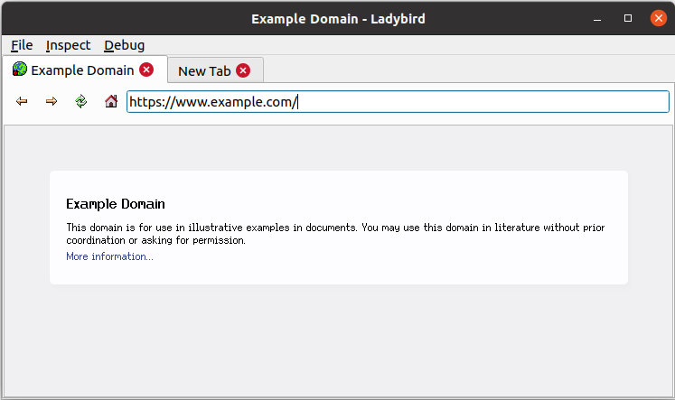

# Coccinellidae Web Browser
The Coccinellidae web browser. The goal is to create a traditional browser UI (how things was before Chrome) drawing inspiration from Netscape 3.

This is a fork of [Ladybird](https://github.com/awesomekling/ladybird). Unlike Ladybird the goal here is to create a general purpose browser. (_"But for now, please treat ladybird as a debugging tool for LibWeb. :)"_ [\[1\]](https://github.com/awesomekling/ladybird/pull/20#issuecomment-1184351571) )

This is a personal fork for my own enjoyment and learning :^)

### How does Coccinellidae differ from Ladybird?
- [x] Qt5 support 👍
- [x] Search field (Default search engine Brave)
- [x] Statusbar
- [ ] Large fancy buttons
- [ ] Tabs above content (not above toolbar)
- [x] Starting maximized
- [x] Platform independent shortcuts (QKeySequence::StandardKey)
- [x] Computers only, no plans supporting Android 🖥️

### Progress of functionality in menu:
- [ ] File: Save As
- [ ] File: Print
- [x] Edit
- [ ] Edit: Cut
- [ ] Edit: Copy
- [ ] Edit: Paste
- [ ] Edit: Select All
- [ ] Edit: Find...
- [ ] Edit: Preferences
- [x] Inspect -> View
- [ ] View: Document Info
- [x] Go
- [ ] Go: Back
- [ ] Go: Forward
- [ ] Go: Home
- [x] Debug -> Options
- [x] About
- [ ] About: Help
- [x] About: Repository
- [x] About: About Coccinellidae

### Build instructions
Same as [Ladybird](https://github.com/awesomekling/ladybird) but using Qt5 & Qt5 Wayland (Ubuntu 20.04: `qt5-default` & `qtwayland5`)

It might build with Qt6, make sure to replace [CMakeLists.txt](CMakeLists.txt) with [CMakeLists.qt6.txt](CMakeLists.qt6.txt) before building.

### This is what I'm going for:

Commits are a bit of a mess, contributions are accepted.

## Screenshot Coccinellidae 2022-07-16
_A lot of work remains..._

## Screenshot Ladybird 2022-07-16
