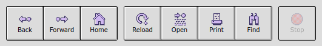
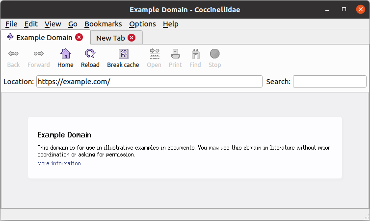
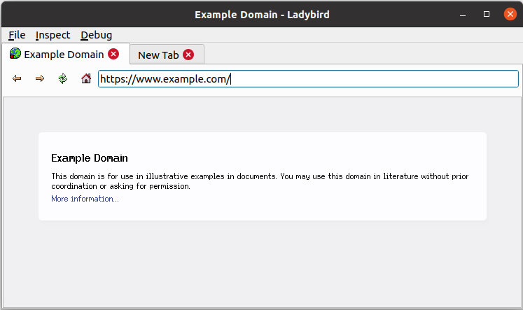

# Coccinellidae Web Browser
The Coccinellidae web browser, a fork of [Ladybird](https://github.com/awesomekling/ladybird). The goal is to create a general purpose browser with a traditional browser UI (how things was before Chrome) drawing inspiration from Netscape 3.

This is a personal fork for my own enjoyment and learning, but feel free to contribute :^)

### How does Coccinellidae differ from Ladybird?
- [x] Qt5 support 👍
- [x] Search field (Default search engine Brave)
- [x] Statusbar
- [ ] Large fancy buttons
- [ ] Tabs above content (not above toolbar)
- [x] Starting maximized
- [x] Platform independent shortcuts (QKeySequence::StandardKey)
- [x] Computers only, no plans supporting Android 🖥️

### Progress of functionality in menu:
There is a bunch of placeholder buttons and menu-items. There is also a bunch of working menu-items and buttons. :^)

### Build instructions
Same as [Ladybird](https://github.com/awesomekling/ladybird) but using Qt5 & Qt5 Wayland (Ubuntu 20.04: `qt5-default` & `qtwayland5`)

It might build with Qt6, make sure to replace [CMakeLists.txt](CMakeLists.txt) with [CMakeLists.qt6.txt](CMakeLists.qt6.txt) before building.

### This is what I'm going for:

## Screenshot Coccinellidae
2022-07-28
_A lot of work remains..._

## Screenshot Ladybird
2022-07-16
